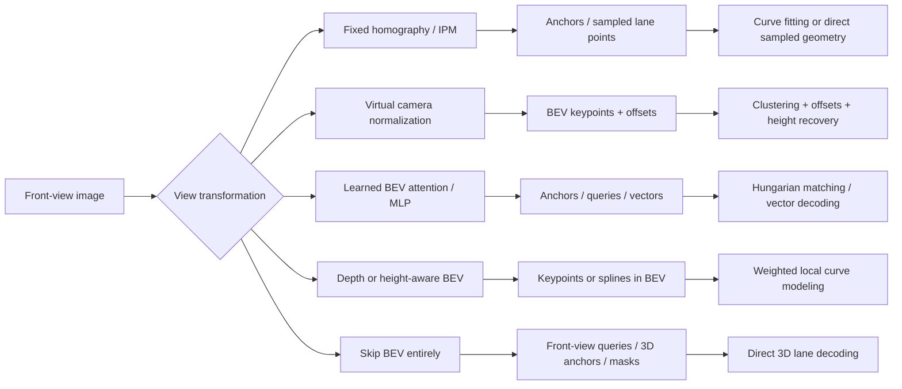
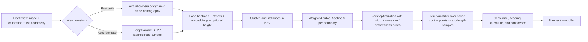

# BEV Lane Detection and Geometry Extraction for Autonomous Driving

## Executive summary

Your current stack—fixed bird’s-eye-view warping with `cv2.warpPerspective`, followed by lane-polynomial fitting and downstream curvature / heading / centerline computation—is still a sensible baseline. The literature suggests, however, that its largest systematic error source is usually **not the polynomial fit itself**, but the **single-plane road assumption** behind the homography. Once the road has pitch changes, crests, dips, bank, or intersection geometry, a planar warp distorts lane shape enough that curvature and heading errors become control-relevant. The papers most directly relevant to improving that failure mode are **HeightLane** and **LaneCPP**, which explicitly replace flat-road BEV with height- or surface-aware transformations; **BEV-LaneDet** is the strongest “keep BEV simple and fast” baseline; and **PersFormer**, **LATR**, and **Anchor3DLane** are useful contrasts because they show where BEV helps and where it hurts. citeturn11view1turn9view1turn10view0turn16view0turn17view1turn23view1turn22search0

Across the field, method design has evolved along three axes. First, **view transformation** moved from fixed or predicted homography/IPM to learned attention-based BEV, then to height/depth-aware lifting, and finally to multi-camera BEV map construction. Second, **lane representation** moved from anchor grids and sampled points toward keypoints, splines, and vectorized lane segments. Third, **geometry extraction** moved away from heavy heuristic post-processing toward direct regression plus lightweight clustering or optimization, often with structural priors such as lane parallelism, curvature smoothness, or topology consistency. citeturn31view0turn32search0turn17view1turn16view0turn10view0turn9view2turn15view0turn15view2

If you want the strongest practical upgrade path with minimal wasted effort, the literature points to this order of operations: **replace flat homography with height-aware BEV**, **replace global polynomials with piecewise cubic splines or another local continuous curve model**, **fit left/right boundaries jointly with soft width/parallelism priors**, **add temporal filtering on a fixed ego-frame arc-length grid**, and **propagate confidence/uncertainty into the controller rather than forcing a hard geometry estimate every frame**. The same papers also imply a clear trade-off: the more explicitly you model 3D road shape and topology, the more labeling, calibration, and compute you may need—but those upgrades pay off most in exactly the scenarios that challenge control the most: slopes, merges, intersections, occlusion, night, and weather. citeturn11view1turn10view0turn26view4turn16view0turn23view1turn27view0turn7search6turn16view3

## Method landscape

The contemporary literature is best understood as five method families:

1. **Fixed-homography / IPM BEV**: classical or differentiable inverse-perspective mapping, usually with anchor-based or grid-based decoding. This is the direct ancestor of your current pipeline. citeturn31view0turn32search0  
2. **Virtual-camera or calibration-normalized BEV**: still homography-like, but with camera normalization to reduce cross-vehicle variance. citeturn16view0turn16view1  
3. **Learned BEV by attention or MLP projection**: front-view features are transformed into BEV latent space by learned modules rather than explicit planar warps. citeturn17view1turn16view0  
4. **Depth- or height-aware BEV**: the BEV transform is explicitly conditioned on depth / ground height / road-surface hypotheses, which is the most relevant family for fixing slope-induced geometry errors. citeturn11view1turn10view0  
5. **BEV-free 3D lane detection**: methods sidestep BEV because misaligned or over-simplified view transforms can be worse than working directly in front view with geometric queries or point sets. These methods matter because they reveal the failure modes of BEV pipelines, even if you ultimately keep BEV in deployment. citeturn23view1turn22search0turn27view0turn22search12



That taxonomy is a direct synthesis of the core monocular 3D lane papers and the online HD-map/vector-map papers: 3D-LaneNet and Gen-LaneNet for IPM BEV; PersFormer and BEV-LaneDet for learned or normalized BEV; HeightLane and LaneCPP for explicit road-shape-aware BEV; LATR, Anchor3DLane, CurveFormer, SALAD, and later sparse-point refinements for the BEV-free branch; and HDMapNet, MapTR, LaneSegNet, and GeMap for lane geometry plus topology in multi-view BEV mapping. citeturn31view0turn32search0turn17view1turn16view0turn11view1turn10view0turn23view1turn22search0turn22search12turn27view0turn15view2turn15view0turn9view2turn14view3

## Comparative tables

### BEV-based lane detection and BEV lane-geometry methods

| Year | Method | Venue | Lead authors | BEV transformation | Lane representation | Geometry extraction steps | Datasets | Headline metrics | Reproducibility / cost | Sources |
|---|---|---|---|---|---|---|---|---|---|---|
| 2025 | **HeightLane** | arXiv preprint | Chaesong Park, Eunbin Seo, Jongwoo Lim | **Height-aware explicit transform**: predict dense BEV heightmap using multi-slope anchors, then use deformable attention from front view to BEV | BEV keypoints + x-offset + embedding + heightmap | Cluster BEV cells by embedding; recover x by offset, z by heightmap; auxiliary 2D lane head | OpenLane; LiDAR accumulation from entity["company","Waymo","autonomous driving company"] used to form height GT | OpenLane val: **F1 62.5**, x-near 0.25, x-far 0.29, z-near 0.11, z-far 0.18 | Input 576×1024; ResNet-50; BEV grid 200×48 at 0.5 m/pixel; losses include BCE/IoU, offset, embedding, L1 heightmap, auxiliary 2D lane loss; code not surfaced in the gathered sources | citeturn9view1turn11view1turn11view4turn11view0 |
| 2024 | **LaneCPP** | CVPR 2024 | Maximilian Pittner, Joel Janai, Alexandru P. Condurache | **Road-surface-hypothesis lifting** to 3D, then weighted accumulation into BEV; explicitly not flat IPM | **Continuous 3D B-splines** with visibility spline | Pool features along line proposals; regress spline control-point offsets; apply analytical priors for parallelism, surface smoothness, and curvature | OpenLane, Apollo 3D Synthetic | Paper reports SOTA F-score/geometric errors; HeightLane’s comparison table reports **OpenLane F1 60.3** for LaneCPP | Modified EfficientNet backbone; Adam; best ablation uses **5 surface hypotheses**; code availability unclear in the gathered primary sources | citeturn10view0turn36view1turn36view2turn11view4 |
| 2024 | **LaneSegNet** | arXiv preprint / code release | Tianyu Li, Peijin Jia, Bangjun Wang, et al. | Multi-view BEV feature extraction with encoder layers; lane-segment-centered map representation | **Lane segment** = left boundary + right boundary + centerline + lane type + topology | DETR-style matching; regress lane-segment vectors plus masks; topology head predicts graph relations | OpenLane-V2 | Lane-segment perception: **mAP 32.6**, APls 32.3, APped 32.9, TOPlsls 8.1, 14.7 FPS | ResNet-50 + FPN; 3 BEV encoder layers; 6 decoder layers; AdamW; batch 8 on 8 V100s; geometry + CE/Dice mask + line-type + topology losses; code available | citeturn12view2turn12view1turn12view3turn13view0turn13view1 |
| 2024 | **GeMap** | ECCV 2024 | Zhixin Zhang, Yiyuan Zhang, Xiaohan Ding, et al. | Multi-camera BEV vector-map encoder; geometry-aware learning | Vectorized lane dividers / crossings in BEV | End-to-end vector prediction with geometric losses on angle and distance; decoupled self-attention for shape vs relation | nuScenes, Argoverse 2 | README reports **69.4 mAP** on nuScenes (R50 full, 13.3 FPS), **72.0 mAP** with Swin-T, and highlights **71.8 mAP** on Argoverse 2 | Official code, configs, logs, and checkpoints available; camera-only and camera+LiDAR variants reported | citeturn14view3 |
| 2023 | **BEV-LaneDet** | CVPR 2023 | Ruihao Wang, Jian Qin, Kaiying Li, et al. | **Virtual Camera** homography to normalize intrinsics/extrinsics, then **Spatial Transformation Pyramid** (MLP-based) into BEV | **BEV keypoints** + offsets + embeddings + lane height | Mean-shift clustering on BEV embeddings; offsets refine cell localization; height branch recovers z | OpenLane, Apollo 3D Synthetic | Paper reports **+10.6 F-score** over PersFormer on OpenLane and **+4.0** on Apollo; OpenLane val **F1 58.4**; runtime **185 FPS** | Input 576×1024; total loss = 3D conf + 3D embed + 3D offset + 3D height + auxiliary 2D seg/embed; ~53 GFLOPs for 0.5 m cells + offsets; code available on entity["company","GitHub","software platform"] | citeturn16view0turn16view1turn35view3turn35view4turn39view0turn39view1 |
| 2023 | **3D-SpLineNet** | WACV 2023 | Maximilian Pittner, Alexandru Condurache, Joel Janai | IPM / top-view 3D feature modeling | **Parametric spline representation** | Direct spline-parameter prediction; no heavy post-processing; explicit comparison of polynomial / Bézier / B-spline alternatives | Synthetic 3D lane dataset | Search result reports state-of-the-art on nearly all geometric metrics and highest processing speed on the synthetic benchmark | Paper explicitly states code and trained models are available | citeturn38search0turn38search1 |
| 2023 | **MapTR** | ICLR 2023 | Bencheng Liao, Shaoyu Chen, Xinggang Wang, et al. | Multi-camera BEV transformer for online vectorized maps | Permutation-equivalent **point-set / polyline vectors** | Hierarchical bipartite matching; direct map-element vector decoding | nuScenes, Argoverse 2 | Abstract says **MapTR-nano 25.1 FPS** on RTX 3090, +5.0 mAP over prior camera-only SOTA; repo reports up to **58.7 mAP** (R50, 110 ep) | Official code and models available; multiple backbones and BEV encoders supported | citeturn15view0turn14view0 |
| 2022 | **PersFormer** | ECCV 2022 | Li Chen, Chonghao Sima, Yang Li, et al. | **Perspective Transformer**: front-view to BEV by attention using camera parameters as reference | Unified 2D/3D anchors | Direct 2D+3D anchor detection with auxiliary task; no explicit curve fit | OpenLane, Apollo, ONCE-3DLanes | OpenLane F1 **50.5** (repo later **53.1** for v1.2); ONCE-3DLanes F1 **72.07** | Official code and models; repo shows training/eval docs and configs | citeturn17view1turn17view0turn19view0turn21view0 |
| 2021 | **HDMapNet** | arXiv preprint / code release | Qi Li, Yue Wang, Yilun Wang, Hang Zhao | Multi-camera and/or LiDAR to BEV vectorized local semantic map | Raster-to-vectorized map elements in BEV | Predict semantic and instance map elements; evaluate semantic-level and instance-level metrics | nuScenes | Abstract reports camera-LiDAR fusion outperforms baselines by **more than 50% in all metrics** | Official code and evaluation kit available | citeturn15view2turn14view2 |
| 2020 | **Gen-LaneNet** | ECCV 2020 | Yuliang Guo, Guang Chen, Peitao Zhao, et al. | IPM/top-view geometry encoder with a new coordinate frame; two-stage scalable framework | Geometry-guided lane anchors | Segment first, then geometry encoding; directly calculate 3D lane points from anchor output in new frame | Synthetic 3D lane dataset; public code also supports baseline comparisons | Standard split: **AP 90.1, F1 88.1** | Official code, pretrained models, dataset prep, and evaluation scripts available | citeturn32search0turn29view2 |
| 2019 | **3D-LaneNet** | ICCV 2019 | Noa Garnett, Rafi Cohen, Tomer Pe’er, Roee Lahav, Dan Levi | **Intra-network IPM** with predicted road plane / camera-to-road transform | Anchor-per-column output in top view | Direct detection/regression at anchors; end-to-end, replacing clustering/outlier rejection | synthetic-3D-lanes, 3D-lanes, adapted TuSimple experiment | Synthetic centerline AP **0.952**; real delimiter AP **0.918** | VGG16 dual-pathway; Adam + cyclic LR; paper gives ranges/scales but gathered sources did not expose a public official repo | citeturn31view0turn33view3turn34view0turn34view1turn33view4 |

### BEV-free contrasts that matter for failure analysis and retrofit design

| Year | Method | Venue | Why it matters for a BEV pipeline | Headline result | Reproducibility | Sources |
|---|---|---|---|---|---|---|
| 2025 | **Rethinking Lanes and Points in Complex Scenarios** | CVPR 2025 | Shows that sparse point representations can omit lane extent and induce large geometric errors; adds endpoint patching and PointLane attention to improve PersFormer / Anchor3DLane / LATR | Reports +4.4 F1 on PersFormer, +3.2 on Anchor3DLane, +2.8 on LATR | Code announced as forthcoming | citeturn7search6turn7search2 |
| 2024 | **CaliFree3DLane** | IEEE T-ITS 2024 / 2025 indexing | Useful if your deployed system suffers calibration drift or unavailable extrinsics; performs spatio-temporal BEV without relying on fixed camera parameters | Repo reports SOTA on Apollo, OpenLane, and calibration-free comparisons | Official code repo with training / eval instructions and benchmark tables | citeturn16view3turn8search0turn8search1 |
| 2023 | **LATR** | ICCV 2023 | Strong evidence that poor BEV alignment can dominate error; detects 3D lanes directly in front view with lane-aware queries and dynamic 3D ground PE | OpenLane **F1 61.9**; ONCE **F1 80.59**; Apollo balanced **F1 96.8** | Official code and pretrained models | citeturn23view1turn23view0turn24view0turn24view3turn24view4turn39view2 |
| 2023 | **Anchor3DLane** | CVPR 2023 | Useful geometric post-processing idea even if you keep BEV: equal-width optimization to reduce lateral error | Apollo balanced **F1 95.6**, AP 97.2; OpenLane **F1 53.1** | Official code; later temporal and Anchor3DLane++ extensions | citeturn22search0turn25view1turn26view0turn26view4turn39view3 |
| 2022 | **SALAD** | CVPR 2022 | Demonstrates extrinsic-free 3D reconstruction from segmentation plus spatial context; also introduces ONCE-3DLanes metric | ONCE-3DLanes **F1 64.07**, Precision 75.90, Recall 55.42, CD 0.098 | Dataset, paper, and code project page available | citeturn27view0turn27view2turn28view0turn28view4 |
| 2022/2023 | **CurveFormer** | arXiv 2022 / ICRA 2023 | Strong counterpoint to BEV: direct curve queries avoid view transform altogether, but polynomial-style curve parameterization can limit shape flexibility | Search result reports strong performance on synthetic & real datasets | Paper easy to access; code link surfaced in community indices, but I did not verify an official repo in the gathered primary sources | citeturn22search12turn22search5 |

## Detailed paper notes and methodological takeaways

### Fixed planar BEV and its descendants

**3D-LaneNet** is the foundational BEV-based monocular 3D lane paper. Its key insight was to bring IPM into the network itself rather than only as a preprocessing step: the image-view stream and top-view stream communicate through differentiable projective transformation layers, and the network predicts the road plane needed to determine the homography. Its lane representation is anchor-per-column in top view, which gives a direct end-to-end alternative to segmentation + clustering. The important historical lesson is that the authors already identified why top view helps: lane geometry becomes more translation-invariant and lower-order curve fitting becomes easier in BEV. The important limitation is equally clear: the homography still depends on a road-plane approximation. citeturn31view0turn33view4turn34view0

**Gen-LaneNet** kept the BEV / geometry-anchor idea but made it more generalizable and more sample-efficient. The two-stage design decouples image segmentation from geometry encoding, and the paper explicitly argues that a more geometry-aligned coordinate frame is necessary for transfer to unfamiliar scenes. In practical terms, this is an early sign that the raw choice of BEV coordinate frame matters as much as the CNN backbone. Its official repo is still valuable because it exposes a reproducible training pipeline and a consistent metric suite that later OpenLane papers continue to use. citeturn32search0turn29view2

### Learned BEV, virtual-camera BEV, and road-shape-aware BEV

**PersFormer** is the transition point from explicit IPM toward learned BEV. Instead of hard-warping feature maps, it uses a transformer-style spatial feature transformation in which BEV features attend to front-view regions, guided by camera parameters. The model also couples 2D and 3D lane learning, which is a recurring practical theme: auxiliary 2D supervision stabilizes 3D geometry learning. For your use case, PersFormer’s main value is conceptual: it shows that you do not need to choose between “raw warpPerspective” and “fully BEV-free”; there is a middle ground where BEV is learned, not hardcoded. citeturn17view1turn17view0

**BEV-LaneDet** is the most deployment-friendly paper in the set. It explicitly targets practicality and speed: a Virtual Camera module normalizes intrinsics/extrinsics via homography before the network sees the image, and a lightweight MLP-based Spatial Transformation Pyramid produces BEV features. The head predicts BEV confidence, offsets, embeddings, and lane height; instance grouping is done with a fast mean-shift-style clustering step. The paper’s runtime claim—185 FPS—and the relatively modest GFLOP figure for its winning cell-size configuration make it the strongest “simple, fast, reproducible” baseline if you want to stay close to your current pipeline while modernizing it. citeturn16view0turn35view3turn35view4turn39view0turn39view1

**HeightLane** is the most directly relevant paper if your current errors concentrate on vertical road geometry. It predicts a dense heightmap on a BEV grid using multi-slope anchors, then uses that heightmap in a deformable-attention spatial transform so BEV queries attend to front-view pixels consistent with the predicted ground shape rather than a flat plane. It reuses the keypoint/offset/embedding style head of BEV-LaneDet, which makes it especially practical to interpret as a modular upgrade: keep the BEV/keypoint idea, but replace planar warping with height-aware warping. The reported OpenLane improvements are modest numerically over the best 2023–2024 baselines but highly meaningful because they specifically target hills, bumps, interrupted lanes, and other controller-sensitive geometry. citeturn11view1turn11view4turn11view0

**LaneCPP** goes one step further and attacks both the view transform and the curve model. Instead of a global polynomial or coarse keypoint grid, it predicts continuous 3D B-splines from BEV-like 3D features, with analytically defined priors for lane parallelism, road-surface smoothness, and curvature. Its spatial transformation is also not flat IPM: features are lifted against sampled road-surface hypotheses and accumulated onto a BEV grid with a depth-distribution branch. If your existing pipeline already computes curvature, heading, and centerline, LaneCPP is arguably the richest paper to borrow from because it treats those geometric quantities as first-class modeling objects rather than downstream byproducts. citeturn10view0turn36view0turn36view1turn36view2

**3D-SpLineNet** is the precursor that made spline parameterization explicit. Although it was validated only on synthetic traffic-line data, it showed two things that remain highly relevant to a production BEV stack: local continuous curves are much better behaved than globally coupled polynomial fits, and direct parametric prediction can remove a surprising amount of post-processing complexity. LaneCPP builds directly on that insight and extends it to more realistic 3D lane settings. citeturn38search0turn38search1turn10view0

### From lane boundaries to lane segments and topology

**HDMapNet**, **MapTR**, **LaneSegNet**, and **GeMap** are not just lane detectors in the narrow sense; they are online map-construction methods. That matters because your downstream need is ultimately not “paint pixels in BEV,” but “produce centerlines, headings, curvature, and topological continuity that a controller can trust.” These papers consistently move away from raster masks toward vectorized lane elements or explicit lane segments, and they perform better in intersections, merges, and map-like reasoning precisely because they model relationships between boundaries and centerlines. citeturn15view2turn15view0turn9view2turn14view3

**LaneSegNet** is especially relevant if you need centerlines robustly in intersections. Its central argument is that lanelines and centerlines should not be learned as separate, competing objectives; instead the model should predict a lane segment representation that jointly encodes both boundaries, the centerline, line type, and adjacency. If your controller uses centerline and heading targets, this is the most direct modern literature argument against fitting the centerline independently from whichever boundary estimates happen to be most visible that frame. citeturn9view2turn12view2turn12view3turn12view1

**MapTR** and **GeMap** are the best references if you decide to move from “lane detection” to “vectorized lane/map representation.” MapTR made point-set / permutation-equivalent vector decoding practical and fast; GeMap added geometric losses and relation-aware attention, pushing vector-map accuracy higher. For a steering pipeline, the practical implication is straightforward: vectorized representations can give you stable centerlines and topology without an extra geometric extraction stage, but they demand more annotation structure and typically more engineering than a lane-only detector. citeturn15view0turn14view0turn14view3

### Why the BEV-free branch still matters

The strongest BEV-free papers are worth reading even if you keep BEV, because they isolate where BEV pipelines often fail.

**SALAD** showed that a monocular model can reconstruct 3D lanes from 2D segmentation plus spatial context without explicit or implicit IPM at all, while also introducing the ONCE-3DLanes benchmark and its stricter top-view-IoU-plus-Chamfer evaluation protocol. This is useful for you because it separates the “can I recover 3D lane geometry?” question from the “must I build BEV first?” question. citeturn27view0turn27view2turn28view0

**Anchor3DLane** and **LATR** both argue, differently, that BEV can be the wrong intermediate if it misaligns geometry. Anchor3DLane keeps structural priors by regressing 3D anchors directly in front view and then adds a post-hoc equal-width optimization; LATR uses transformer queries with dynamic 3D ground positional embedding and avoids both anchors and BEV. The practical lesson is not necessarily “abandon BEV,” but “do not over-trust the BEV transform if you can see misalignment in hills, curves, or calibration drift.” citeturn22search0turn26view4turn23view1turn24view3turn39view2

**Rethinking Lanes and Points in Complex Scenarios** is a useful 2025 paper because it dissects a subtle but important issue: sparse point representations can truncate or misrepresent lane extent, leading to surprisingly large geometric errors. Even if you stay with BEV, this is a warning against overly sparse or globally parameterized fit targets for downstream control. citeturn7search6turn7search2

## Concrete improvements for your current pipeline

The literature supports several upgrades that are both implementable and likely to matter for steering performance.

### Replace planar homography with height-aware BEV

If you change only one thing, change this. Your current `warpPerspective` assumes a single road plane, which is exactly what HeightLane and LaneCPP try to remove. The minimal classical retrofit is to estimate pitch/height/bank per frame and recompute the warp from a dynamic road plane. The higher-upside learned version is to predict a dense heightmap or surface hypotheses and warp features onto BEV using that geometry. In practice, this should improve curvature and heading especially over crests, dips, speed bumps, and uphill/downhill transitions. The trade-off is extra model complexity and, if you supervise height explicitly, the need for LiDAR-derived height labels or another source of ground truth. citeturn11view1turn11view4turn10view0turn36view1

### Replace global lane polynomials with local continuous curves

Global polynomials are attractive because curvature is analytically easy, but they are brittle when lanes branch, merge, or contain local slope changes. The spline papers make a strong case for **piecewise cubic B-splines** or another local continuous representation with local control. The practical benefit is not only lower fitting error; it is also better-behaved derivatives, which is what your controller actually consumes. The trade-off is a slightly more complex fitter and more parameters to regularize. If you do not want to retrain a network immediately, you can still upgrade your post-processing today: fit a weighted cubic spline to each lane boundary in ego coordinates rather than a single polynomial in warped image coordinates. citeturn38search0turn10view0

### Fit geometry jointly, not lane-by-lane independently

Anchor3DLane’s equal-width optimization and LaneCPP’s parallelism prior both point in the same direction: fitting left and right boundaries independently throws away a strong structural prior. A practical retrofit is to fit the boundary pair jointly with a soft penalty on rapid lane-width changes, not a hard constant-width assumption. That improves lateral consistency and makes centerline extraction as the midpoint of the two splines much more stable. The trade-off is that soft priors must be relaxed around merges, splits, exits, and intersections, otherwise you will oversmooth real topology. citeturn26view4turn10view0

### Add robust weighting, visibility handling, and uncertainty

Recent papers do **not** mostly use classic RANSAC-heavy post-processing; instead they predict confidence, visibility, embeddings, or masks and then decode geometry with lightweight optimization or clustering. For your pipeline, the actionable takeaway is to carry per-point or per-cell confidence into the curve fit. Fit with **iteratively reweighted least squares using a Huber loss** or a similar robust objective, ignore occluded / low-confidence points, and estimate a covariance for the fitted control points or spline coefficients. That covariance can then modulate controller aggressiveness or preview distance. The trade-off is a more statistical pipeline and the need to calibrate confidence rather than trusting raw logits. citeturn39view1turn11view4turn10view0turn27view0

### Add temporal smoothing in ego coordinates

Frame-to-frame heading jitter is often more damaging to steering than modest per-frame geometric error. Temporal versions of Anchor3DLane and CaliFree3DLane, along with the general trend in recent papers, support maintaining lane state in the current ego frame and updating it over time. A practical implementation is a Kalman or Rauch–Tung–Striebel smoother over spline control points or sampled arc-length stations. Smooth position, heading, and curvature jointly; do not smooth only the final steering target. The trade-off is lag, so you should report both raw accuracy and temporal stability. citeturn25view1turn26view0turn16view3turn8search0

### Keep 2D supervision and multi-task losses even if you output 3D geometry

PersFormer, BEV-LaneDet, and HeightLane all benefit from auxiliary 2D supervision or dual-branch heads. In practice, that usually makes training less brittle and helps recover from weak 3D signal. If you build a learned replacement for your current detector, use a multi-task objective with 2D segmentation or lane heatmaps, 3D offsets/heights, embedding-based instance separation, and geometry regularization. The trade-off is more loss balancing and potentially slower training iteration, but the literature consistently treats this as worthwhile. citeturn17view1turn35view3turn11view4

### Promote centerline and topology to first-class outputs near intersections

If your failures cluster around merges, diverges, or intersections, the lane-only formulation may be the bottleneck. LaneSegNet and the vector-map papers show that modeling lane segments, centerlines, and adjacency directly is much better aligned with what planning and control need in complex topology. The trade-off is that data and evaluation become more like online HD map learning than standard lane detection. citeturn9view2turn12view2turn15view0turn14view3

### Use sensor fusion only where it pays

Camera+LiDAR or camera+map fusion clearly improves geometric accuracy in the mapping papers, and HeightLane’s “GT heightmap” comparison shows how much headroom remains if road height is known accurately. But sensor fusion is not free. If your product stack already has reliable LiDAR or map priors, use them for ground / road-surface estimation or for evaluation at minimum. If not, a camera-only height-aware BEV is the cleaner starting point. citeturn15view2turn11view1turn11view4

A practical upgraded pipeline consistent with the strongest papers would look like this:



This design is not speculative; it is simply a synthesis of BEV-LaneDet’s efficient keypoint decoding, HeightLane’s height-aware transform, LaneCPP’s continuous curves and physical priors, Anchor3DLane’s structural post-optimization, and newer temporal / calibration-robust ideas. citeturn16view0turn11view1turn10view0turn26view4turn16view3

A concrete geometry-extraction pseudocode sketch that stays close to your existing stack is:

```python
# Inputs:
#   lane_prob, lane_embed, lane_offset, lane_height  # network outputs on BEV grid
#   prev_state                                         # previous-frame spline/control-point state
#   ego_motion                                         # odometry / IMU

# 1) Instance decoding
clusters = cluster_embeddings(lane_prob, lane_embed, conf_thresh=0.4)

lanes = []
for cluster in clusters:
    pts = []
    for cell in cluster:
        x, y = bev_cell_center(cell)
        x += lane_offset[cell]          # sub-cell localization
        z  = lane_height[cell]          # or 0 for planar baseline
        w  = confidence_weight(lane_prob[cell])
        pts.append((x, y, z, w))

    # 2) Visibility / outlier handling
    pts = discard_low_confidence(pts)
    pts = project_to_ego_arc_length_order(pts)

    # 3) Robust continuous fit
    spline = fit_cubic_bspline_IRLS(
        pts,
        robust="huber",
        smoothness_penalty=lambda_s,
        curvature_penalty=lambda_k
    )
    lanes.append(spline)

# 4) Joint boundary refinement
lanes = optimize_boundary_pairs(
    lanes,
    width_consistency_penalty=lambda_w,
    allow_merges_splits=True
)

# 5) Temporal smoothing in ego frame
state = temporal_update(prev_state, lanes, ego_motion)

# 6) Downstream geometry
centerline = midpoint_spline(state.left_boundary, state.right_boundary)
heading = tangent_angle(centerline)
curvature = signed_curvature(centerline)
uncertainty = fit_covariance(centerline)
```

The literature-backed changes here are the road-shape-aware transform, spline fitting with explicit curvature / smoothness priors, joint boundary optimization, and temporal state estimation. The exact optimizer can be classical IRLS even if the detector is learned. citeturn10view0turn11view1turn26view4turn16view0

## Suggested experiments and evaluation protocol

The cleanest way to validate improvements to your current production-like pipeline is to separate **perception accuracy**, **geometry quality**, and **control usefulness**.

For datasets, I would use **OpenLane** as the primary benchmark because it is the dominant monocular 3D lane benchmark used by PersFormer, BEV-LaneDet, HeightLane, and LaneCPP; it has large-scale real data and scenario tags such as Up&Down, Curve, Extreme Weather, Night, Intersection, and Merge&Split. I would use **Apollo 3D Synthetic** as the controlled ablation benchmark because many papers report results there and it lets you stress specific geometry conditions cleanly. I would use **ONCE-3DLanes** as a robustness check, especially if calibration quality is imperfect or you want to test extrinsic-free assumptions. If you also want centerline topology, add **OpenLane-V2**, and if you move toward online map learning, add **nuScenes** and **Argoverse 2** through MapTR / GeMap style evaluation. citeturn17view1turn11view4turn10view0turn23view1turn27view0turn12view2turn15view0turn14view3

The recommended experiment matrix is straightforward. Compare: fixed homography vs dynamic-plane homography vs learned height-aware BEV; global polynomial vs piecewise spline; independent boundary fitting vs joint width-aware fitting; per-frame fit vs temporal smoothing; confidence-agnostic vs confidence-weighted fit; and, if available, camera-only vs camera+height / LiDAR-assisted road-surface estimation. Report results separately for the full validation set and for scenario slices—especially Up&Down, Curve, Night, and Merge&Split—because those are the scenarios where the BEV transform and the geometry extractor most directly affect control. citeturn11view0turn24view3turn17view1turn26view0

For metrics, do not stop at the benchmark’s F1 / AP / x-z error. Keep those, because they make your results legible relative to the literature. But add a **control-facing metric suite**:
- lateral centerline error at fixed lookahead distances, such as 5 m, 10 m, 20 m, 30 m, 50 m;
- heading error at the same longitudinal stations;
- curvature error and curvature-derivative smoothness;
- centerline continuity under occlusion and merges;
- frame-to-frame variance of heading and curvature at fixed arc-length positions;
- calibration of uncertainty if you add confidence-aware fitting;
- if you have simulation access, closed-loop lane-keeping metrics such as RMS cross-track error, steering rate, intervention count, and failure in crest / merge / weather scenarios.  
Those extra metrics are the best way to prevent a model from “winning” on F1 while still destabilizing steering. The literature strongly suggests this can happen, especially when the representation is too coarse or the BEV transform is geometrically biased. citeturn39view2turn39view1turn10view0turn7search6

A practical split recommendation is:
- **OpenLane**: train on the official training split, validate on the official validation split, and always break out the six scenario subsets.
- **Apollo 3D Synthetic**: report the standard balanced, rare-subset, and visual-variation splits used by Gen-LaneNet, Anchor3DLane, BEV-LaneDet, and LATR.
- **ONCE-3DLanes**: use the official training/test protocol and report F1, precision, recall, and Chamfer distance under the standard threshold.  
That will make your internal ablations directly comparable to the literature while still letting you rank designs by steering usefulness. citeturn11view4turn29view2turn39view3turn23view0turn27view0

## Open questions and limitations

This report is strongest on papers with clearly accessible primary sources and official repos. A few newer or highly relevant papers do **not** expose every implementation detail or public code path cleanly in the gathered sources. In particular, **LaneCPP** and **HeightLane** were easy to inspect as papers, but I did not verify official public code releases from the sources gathered here; **Rethinking Lanes and Points in Complex Scenarios** is very new and still framed as code-coming-soon; and some older baselines such as 3D-LaneNet are better documented in paper text than in an official public codebase. citeturn10view0turn9view1turn7search6turn31view0

The other boundary to keep in mind is task mismatch. The strongest geometry/topology papers—LaneSegNet, MapTR, GeMap, and HDMapNet—optimize online map quality, not only per-frame lane detection. They are still relevant to your problem because they produce stable centerlines and topology, but moving to those formulations is a larger product decision than simply “improve polynomial fitting on BEV.” citeturn9view2turn15view0turn14view3turn15view2